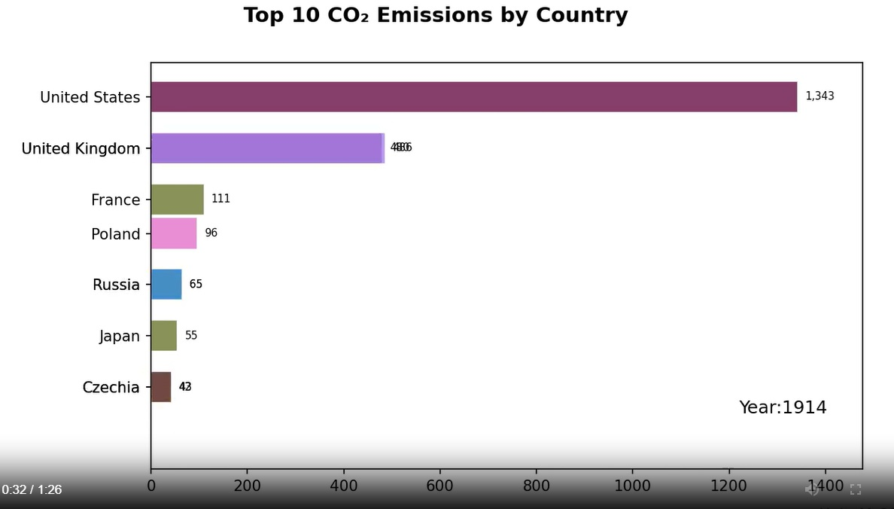

# CO₂ Emissions — Bar Chart Race (Python)

Create a **bar chart race** video of the **Top 10 CO₂-emitting countries** over time using Python.

<a href="https://wumingye2009.github.io/Blog/.../Global_CO2_Emissions.mp4">
  
</a>


## ✨ Features
- Converts tidy CSV into a **wide** time × country matrix for animation
- Clean, configurable rendering (title, margins, bar size, tick size)
- Works **yearly** or **every N years** (step sampling)
- Exports **MP4**; optional GIF fallback
- Easily add background music afterward

---

## 📁 Project Structure
```
BAR_CHART_RACE/
├── data/
│ └── co2_emissions.csv
├── images/ # output videos/images
├── src/
│ └── app.py
├── requirements.txt
└── README.md
```
---

## 🔧 Prerequisites
- Python 3.9+ (3.10/3.11 are fine)
- [ffmpeg](https://ffmpeg.org/) available on your PATH (for MP4 export)
  - Windows: add `.../ffmpeg/bin` to **Path** (user or system)
  - Verify: `ffmpeg -version`

> If ffmpeg isn’t available, you can export a GIF by changing the output extension to `.gif`, but the file will be larger.

---

## 📦 Setup

```bash
# 1) clone
git clone https://github.com/wumingye2009/Bar_Chart_Race.git
cd <your-repo>

# 2) (optional) create & activate a virtual env
python -m venv .venv
# Windows:
.venv\Scripts\activate
# macOS/Linux:
source .venv/bin/activate

# 3) install deps
pip install -r requirements.txt
```

## 🗂 Data

Your CSV (data/co2_emissions.csv) should contain at least these columns:

Name — country name

year — year (integer)

co2 — total CO₂ emissions (MtCO₂)

If your headers differ, update the column names in src/app.py.


## 📜 License

This project is powered by MIT License

